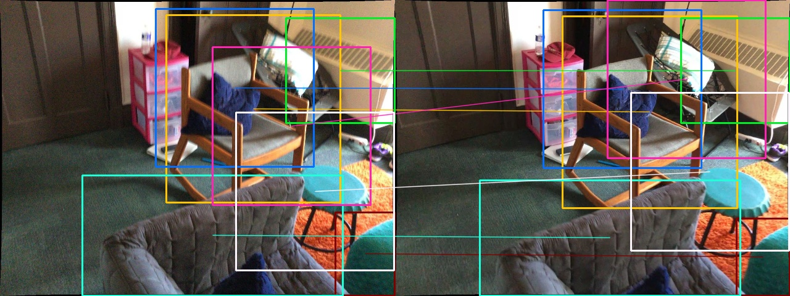

<!--
 * @Author: EasonZhang
 * @Date: 2024-01-11 21:41:08
 * @LastEditors: Easonyesheng preacher@sjtu.edu.cn
 * @LastEditTime: 2024-06-05 16:28:41
 * @FilePath: /SGAM/README.md
 * @Description: ReadMe
 * 
 * Copyright (c) 2024 by EasonZhang, All Rights Reserved. 
-->
# SGAM
This is the the offical code release for the paper: `Searching from Area to Point: A Semantic Guided Framework  with Geometric Consistency for Accurate Feature Matching', by Yesheng Zhang and Xu Zhao and Dahong Qian.


# Qualitative Results
- On challenging scenes.

---
- Continuous matching results; from top to bottom: `SGAM`, `SGAM_ASpan`, `ASpan`.


# TODO
- [ ] Main Code release
    - [x] SAM
    - [x] GAM
- [ ] Demo Code construction
    - [x] SAM demo @ 2024-06-05
    - [x] SGAM demo @ 2024-06-06
- [ ] ReadMe Complete

# Environment Configuration

## torch
You can install torch like:
```shell
    conda create -n sgam_aspan python==3.8
    conda activate sgam_aspan
    pip install torch==2.0.0+cu118 torchvision==0.15.1+cu118 torchaudio==2.0.1 --index-url https://download.pytorch.org/whl/cu118
```

## other packages
```shell
    pip install -r requirements.txt
```

## configuration for point matcher

Point matchers including [SuperPoint](https://github.com/magicleap/SuperPointPretrainedNetwork), [SuperGlue](https://github.com/magicleap/SuperGluePretrainedNetwork), [ASpanFormer](https://github.com/apple/ml-aspanformer), [LoFTR](https://github.com/zju3dv/LoFTR), [QuadTree](https://github.com/Tangshitao/QuadTreeAttention) and [DKM](https://github.com/Parskatt/DKM) can share the same conda environment.

## ASpanFormer
Please follow the instructions in [ASpanFormer](https://github.com/apple/ml-aspanformer).

Note, the environment for ASpanFormer can be shared with the environment for SGAM. That is, you have no need to create a new conda environment for ASpanFormer, but just install the required packages in the same environment `sgam_aspan`. 

Similarly, you can install other aforementioned point matchers in the same environment i.e. `sgam_aspan`.


# Demo

## Semantic Area Matching Demo

The demo for semantic area matching is provided in `./demo/semantic_area_match_demo.py`.

You can directly run it as:

``` shell
    cd demo
    python semantic_area_match_demo.py
```

This will match the image `0.jpg` with `5.jpg`, which are provided in `/opt/data/private/SGAM/demo/demo_data`, using the ground truth semantic labels.
 The image selection can be adjusted in the script:
    
``` python
    SAMer_cfg = assemble_config_with_scene_pair(SAMer_cfg, scene="scene0002_00", pair0="0", pair1="5", out_path="")
```

After running, the results can be found in `demo/demo_sam_res`, including area matches, doubtful area pairs, semantic object areas and semantic intersection areas, like we provided.

The semantic area matching results are shown as below:


The doubtful area pairs are shown as below:


The code for combination of [SEEM](https://github.com/UX-Decoder/Segment-Everything-Everywhere-All-At-Once) will be released soon.

## SGAM Demo
> We are still working on the SGAM demo, including refactoring the code due to the complexity of the configuration of SGAM. We will release the refactored code soon.

You can run the demo for SGAM as:

``` shell
    cd demo
    python sgam_demo.py
```
After that, the results will be saved in `demo/demo_sgam_res`, including the predicted doubtful area pairs (results of GP), rejected area pairs (results of GR).

The results of GP are shown as below:


We also report the pose error between the baseline (ASpanFormer) and our SGAM. You should see:
``` shell
| SUCCESS  | __main__:pose_eval:93 - calc pose with 1000 corrs
2024-06-06 23:19:32.632 | SUCCESS  | utils.geo:compute_pose_error_simp:1292 - use len=1000 corrs to eval pose err = t-14.6511, R-0.3452
2024-06-06 23:19:32.632 | SUCCESS  | __main__:<module>:207 - ori pose error: [0.3452374520071945, 14.651053301930869]
2024-06-06 23:19:32.633 | SUCCESS  | __main__:pose_eval:93 - calc pose with 1000 corrs
2024-06-06 23:19:32.690 | SUCCESS  | utils.geo:compute_pose_error_simp:1292 - use len=1000 corrs to eval pose err = t-10.8309, R-0.2458
2024-06-06 23:19:32.691 | SUCCESS  | __main__:<module>:213 - SGAM-5.0 pose error: [0.24582250341773104, 10.830935884665799]
```

In this case, the pose error is reduced from `0.3452` to `0.2458` for rotation and `14.6511` to `10.8309` for translation.


# Citation
If you find this code helpful, please cite:

``` txt
@article{zhang2023searching,
  title={Searching from Area to Point: A Hierarchical Framework for Semantic-Geometric Combined Feature Matching},
  author={Zhang, Yesheng and Zhao, Xu and Qian, Dahong},
  journal={arXiv preprint arXiv:2305.00194},
  year={2023}
}
```

# Aknowledgement

We thank the authors of [SuperPoint](https://github.com/magicleap/SuperPointPretrainedNetwork), [SuperGlue](https://github.com/magicleap/SuperGluePretrainedNetwork), [ASpanFormer](https://github.com/apple/ml-aspanformer), [LoFTR](https://github.com/zju3dv/LoFTR), [QuadTree](https://github.com/Tangshitao/QuadTreeAttention) and [DKM](https://github.com/Parskatt/DKM) for their great works.

We also thank the authors of [SEEM](https://github.com/UX-Decoder/Segment-Everything-Everywhere-All-At-Once) for their great works.

